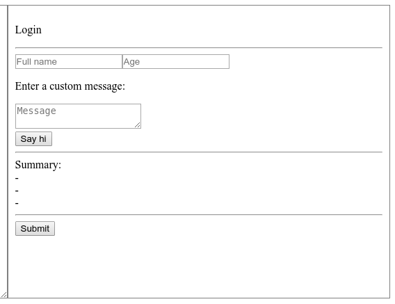

# HTML form generator

### Context

You take over the job of someone that did not have the time to complete his task. His task was to implement a web app that allows users to generate an HTML form based on a custom string format.

### App presentation


The app contains 3 parts:
- The left side of the screen is the string representing the HTML form. It is a textarea that can be modified by the user.
- The top button titled 'Generate' allows to generate the HTML form (on the right) based on the content of the textarea (on the left).
- The right side of the screen is the generated form, based on the content of the textarea from the left side of the screen.

### Specifications

**Form element types**

- Only specific form elements types can be specified. The list of allowed form elements types are listed below:
  - `input`: HTML input tag
  - `p`: HTML p tag
  - `br`: HTML br tag
  - `hr`: HTML hr tag
  - `textarea`: HTML textarea tag
  - `button`: HTML button tag
  - `submit`: HTML input with type 'submit' (`<input type="submit">`)
  - `summary`: HTML div tag (`<div></div>`) which contains all the values of the input and textareas in the form
- Each of these form element type can only contain specific HTML attributes. The list of the allowed attributes for each form element type is defined below:
  - `input`: `id`, `class`, `style`, `type`, `placeholder`, `value`
  - `p`: `id`, `class`, `style`
  - `br`: `id`, `class`
  - `hr`: `id`, `class`
  - `textarea`: `id`, `class`, `style`, `cols`, `rows`, `placeholder`
  - `button`: `id`, `class`, `style`, `type`, `onclick`
  - `submit`: `id`, `class`, `style`, `onclick`
  - `summary`: None
- Depending on form element types, the inner html of these components **must** be set, **must not** be set, or **can** be set (optional)
  - `input`: no inner html can be provided
  - `p`: inner html must be provided
  - `br`: no inner html can be provided
  - `hr`: no inner html can be provided
  - `textarea`: inner html can be provided or not
  - `button`: inner html can be provided or not
  - `submit`: no inner html can be provided
  - `summary`: no inner html can be provided


**Summary**

The summary is a div which contains the list of values from all inputs (of any type) and textareas in the generated form and must be updated in real time when they are edited. Its format should be the following:

```text
Summary:
- $0
- $1
- $2
```

Where $0, $1, $2 should be replaced by the values of the 3 inputs and textareas in the form. There should be as many elements in the summary list as the sum of inputs and textarea in the form, and the values should be displayed in the same order as their respective element is in the form.


**Format**

- Each non-empty line of the text format represents exactly one form element to be displayed
- The formal description of the format is defined by the rules below:
  - lines -> lines + '\n'
  - lines -> line
  - line -> ''
  - line -> type + attributes + innerhtml
  - type -> 'input'
  - type -> 'p'
  - type -> 'br'
  - type -> 'hr'
  - type -> 'textarea'
  - type -> 'button'
  - type -> 'submit'
  - type -> 'summary'
  - attributes -> ''
  - attributes -> '[' + attribute_definitions + ']'
  - attribute_definitions -> blanks + attribute_definition + blanks + ',' + attribute_definitions
  - attribute_definitions -> attribute_definition + blanks
  - attribute_definition -> attribute_name + '=' + string_in_double_quotes
  - string_in_double_quotes -> `/^"(?:[^"\\]|\\.)*"$/`
  - attribute_name -> 'id'
  - attribute_name -> 'class'
  - attribute_name -> 'style'
  - attribute_name -> 'type'
  - attribute_name -> 'onclick'
  - attribute_name -> 'cols'
  - attribute_name -> 'rows'
  - attribute_name -> 'placeholder'
  - attribute_name -> 'value'
  - innerhtml -> ''
  - innerhtml -> ':' + `/^.+$/`
  - blanks -> `[ ]*`


**Code architecture**

No major new feature will be added to this application once you have implemented it, but the specifications above are likely to change often in the upcoming years, and other developers might have to make these changes themselves in your code. You should take this into account when thinking about the architecture of your solution.

**Error Handling**

In case the format is invalid, the generated form should be emptied when the `Generate` button is pressed, and no error message should be displayed to the user.

A format is considered invalid if it does not follow the grammar rules or the specifications above.

### Examples

**Valid format example**

```text
p:Login
hr

input[type="text", placeholder="Full name"]
input[type="number", placeholder="Age"]

p:Enter a custom message:
textarea[placeholder="Message"]
br

button[onclick="alert(\"Hi 'yourself'\")"]:Say hi

hr
summary
hr

submit
```

Should display on the right panel, once the 'Generate' button is clicked:



Then, if a value is set for the 'Full name' and 'Age' inputs, it should appear instantly in the summary:


**Invalid format examples**

Below are examples of invalid formats:

```text
p:This line is valid
summary:This line is not, because there can't be an inner html given in a summary element
```

```text
thiselementdoesnotexist
```

```text
p[onclick="alert('The onclick attribute can not be appended to this element')"]
```

```text
p :The grammar does not allow spacing between the element type and ':'
```

```text
button[onclick="alert("Invalid quotes")"]
```

### Deliverables

Your task is to implement the web app.

Your code must be compatible with ES7 but not use features only available in ES8 or newer. Your code should be as modern and maintainable as possible.

You are free to modify and add new files to the project if you think this is necessary.

### Automatic testing

Your solution will be tested using headless browser testing. It means that there are some things that you should NOT change in `index.html` so that the tests can pass:
- The `Generate` button should keep its id `generate`
- The div that contains the form should keep its id `generated`
- The textarea on the left should keep its id `formatted`
- Your app should not import files over the network

### Ranking

Your code will be evaluated on the following points (from most important to least important):
- **Architecture of the code for long term maintainability**
- Correctness of the program
- Clarity of the code and comments relevance
- Performance efficiency
