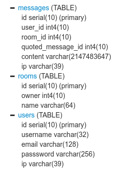

# IRC-like application

### Context

You are helping a friend building an IRC-like application. 

He started the database design but he asks for your help to write the SQL queries to fetch data and how to improve the performance of these queries by adding indexes to the tables.

### Problem

This IRC application is a simple application that allows users to send public messages to each others in different channels (rooms).

Users first need to connect using their username and password, then join a room. Once they joined a room, they can send messages to other users connected in the room. It is possible to quote other messages in order to reply to them.

The PostgreSQL database does not keep track of what room users are in or if users are currently connected or not. It only serves as a persistent storage for users, rooms and messages for when the server goes down.

The schema of the database is available in `00-setup.sql`. It is also represented visually below:



Your job is to implement the queries corresponding to the requirements below and provide the modifications to the database in order to make the queries more efficient.

### Queries

The following queries should be written in the `02-queries.sql` file:
```sql
-- 1. What user posted the most messages in room 1 (room whose id is 1), and how many did he sent?
--     - Your query should return a table with columns (`user_id`, `count`)
--     - Your query should return at most 1 row.

-- 2. In what room the user 1 (user whose id is 1) has sent the most messages, and how many messages did he sent in this room?
--     - Your query should return a table with columns (`room_id`, `room_name`, `count`)
--     - Your query should return at most 1 row

-- 3. Is there any message quoting a message which has been posted in a different room?
--     - Your query should return a table with columns (`message_id`, `message_room_name`, `quoted_message_id`, `quoted_message_room_name`)
--     - Results should be sorted by descending message_id

-- 4. For each user, display the number of different ips he used
--     - Ips should be retrieved from the `users` and `messages` tables
--     - Your query should return a table with columns (`user_id`, `count`)
--     - Results should be sorted by ascending user_id

-- 5. How long is the quote chain for message 7 (message whose id is 7)?
--     - Example: If message C quotes message B which itself quotes message A, and we consider message C, then there is a quote chain from message A to message B and the length of the quote chain is 2 (= number of embedded quotes).
--     - Your query should return a table with a single column named `count`
--     - Your query should return at most 1 row

-- 6. What is the maximum quote chain length?
--     - Your query should return a table with columns (`message_id`, `count`) where message_id is the id of the message which is quoting all the others
--     - Your query should return at most 1 row
```
Feel free to add comments in the sql files if you think this is necessary to understand your reasoning.


The following modifications should be implemented in the `00-setup.sql` file:
```sql
-- 7. Modify the database schema in order to improve the performance of all the queries in 02-queries.sql
--     - You can modify the database schema as you wish as long as the queries are executed properly by PostgreSQL 9.3.
--     - For each modification, justify your choice with a comment
```

### Deliverable

All of your queries should be implemented in a file named `02-queries.sql`.

The queries should be placed in the same order as the corresponding questions in this document.

Your queries will also be tested with other datasets (different `01-populate.sql` files will be used), including large datasets.

### Development workflow

In order to debug the queries you have to implement, it is recommended to use [SQLFiddle](http://sqlfiddle.com/#!15) in order to avoid setting up a local PostgreSQL database.

Put the content of the `00-setup.sql` and `01-populate.sql` files on the left panel, then press `Build Schema` to setup the database. Then, use the right panel to write and run queries.

### Ranking

Your code will be evaluated on the following points (from most important to least important):
- Correctness of the results
- Performance efficiency
- Clarity of the queries
